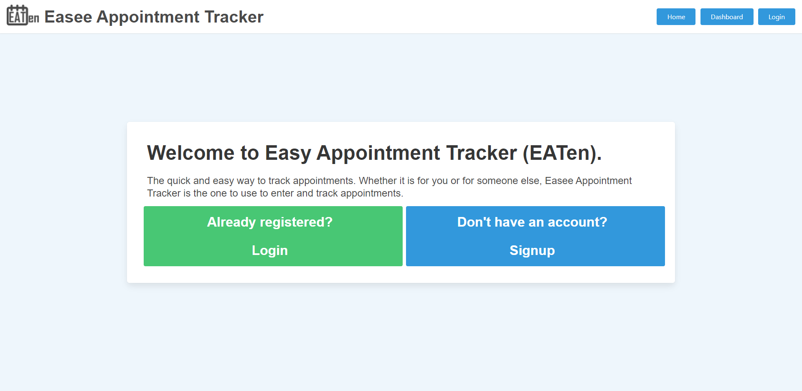
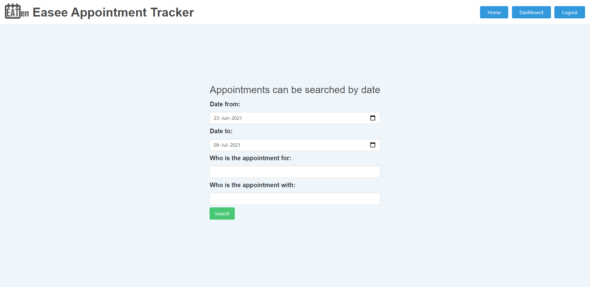

# Easee Appointment Tracker 

[](https://opensource.org/licenses/MIT)

## Description

An easy to use appointment tracking system for people looking for a quick and secure way to record and track appointments for themselves and/or for others they are caring for.

## 📖Table of Contents
1. [Installation](#installation)
2. [Usage](#usage)
3. [Assets](#assets)
4. [Technologies](#technologies)
5. [Planning](#planning)
6. [License](#license)
7. [Contributing](#contributing)
8. [Tests](#tests)
9. [Collaborators](#collaborators)
10. [Questions](#questions)

## Installation
1. To install this application clone it through GitHub using the following code in the terminal: 
    ``` 
    git clone https://github.com/ShaneCurtis84/Easy-Appointment-Tracker-2.0.git
    ```
2. To add the dependencies to the application, navigate to the root directory for the application and run:
    ```js
    npm install
    ```
    
## Usage
Once the host, port, user, password and database details have been provided to the connection and the database has been created, navigate to the root directory for the application and run the following code in the terminal to start the application:
```js
npm start
```

## Assets
Live demo of the application hosted on Heroku: [Easee Appointment Tracker](https://afternoon-beyond-55572.herokuapp.com/)

The following images shows the functionality of the application: 





## Technologies
- [Node.js](https://nodejs.org/en/docs/)
- [dotenv](https://www.npmjs.com/package/dotenv)
- [Express](https://expressjs.com/)
- [mysql2](https://www.npmjs.com/package/mysql2)
- [Nodemon](https://www.npmjs.com/package/nodemon)
- [Sequelize](https://sequelize.org/v5/index.html)
- [bcrypt](https://www.npmjs.com/package/bcrypt)
- [Connect Session Sequelize](https://www.npmjs.com/package/connect-session-sequelize)
- [Express Handlebars](https://www.npmjs.com/package/express-handlebars)
- [flatpickr](https://www.npmjs.com/package/flatpickr)
- [Heroku](https://www.heroku.com/)
- [Bulma CSS Framework](https://bulma.io/)
- [Font Awesome (icons)](https://fontawesome.com/)
- [Google Places API](https://developers.google.com/maps/documentation/places/web-service/overview)
- [Google Maps JavasScript API](https://developers.google.com/maps/documentation/javascript/overview)
- JavaScript

## Planning:
- [Press Release](https://docs.google.com/document/d/1lAA5RESKgXhbgahGP1YxLDHGO7LA8qTXGwPqubn1iC0/edit?usp=sharing)
- [User Story Map](https://miro.com/app/board/o9J_l_vMW5U=/)
- [Presentation](https://docs.google.com/presentation/d/1zoVdW4md6lIe7DGZ3RoNBZL2hEFLmLkF-7MQ-9AdEbk/edit?usp=sharing)

## License
This project is [MIT](./LICENSE) licensed

## Contributing
Contributions, issues and feature requests are welcome.

Feel free to check the [issues page](https://github.com/ShaneCurtis84/Easy-Appointment-Tracker-2.0/issues) if you want to contribute.

## Tests
There are no tests currently for this application.

## Collaborators
[Shane Curtis](https://github.com/ShaneCurtis84)

[Susanne Bilney](https://github.com/Susanne85)

[Trushil Budhia](https://github.com/TrushilBudhia)


## Questions
For any questions, please contact the authors:

- Github: [@Shane](https://github.com/ShaneCurtis84), [@Susanne](https://github.com/Susanne85), [@Trushil](https://github.com/TrushilBudhia)

